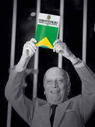
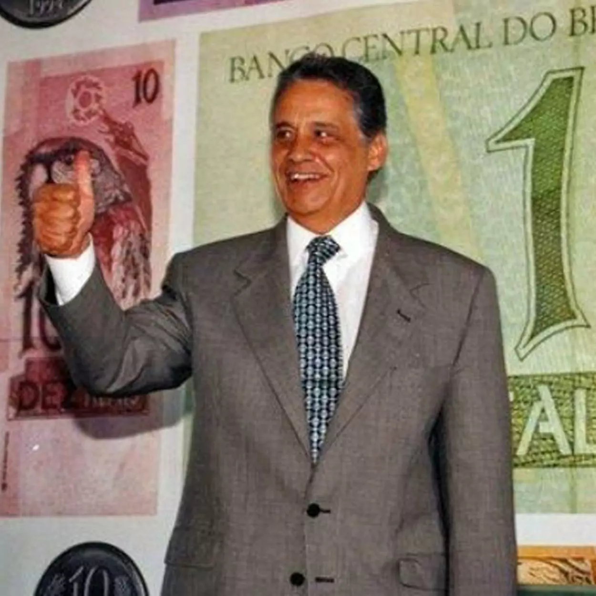
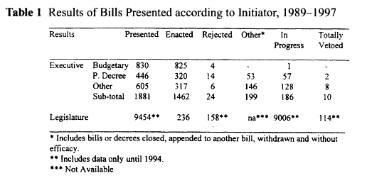
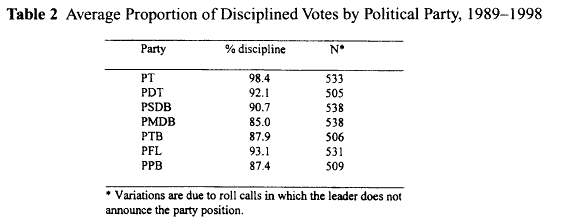
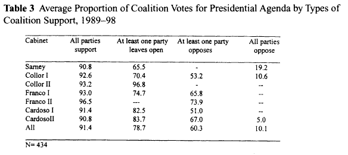
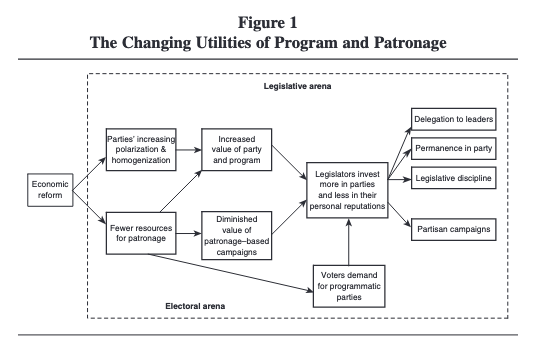
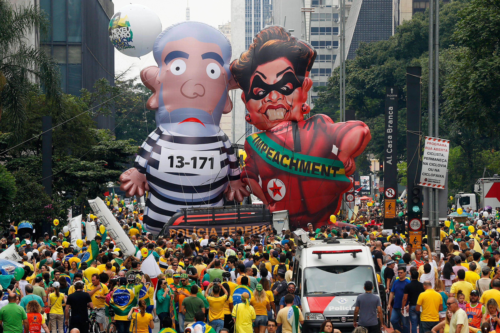
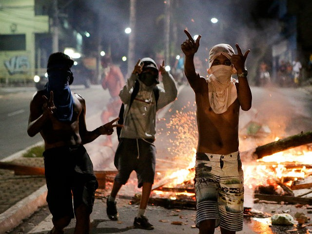
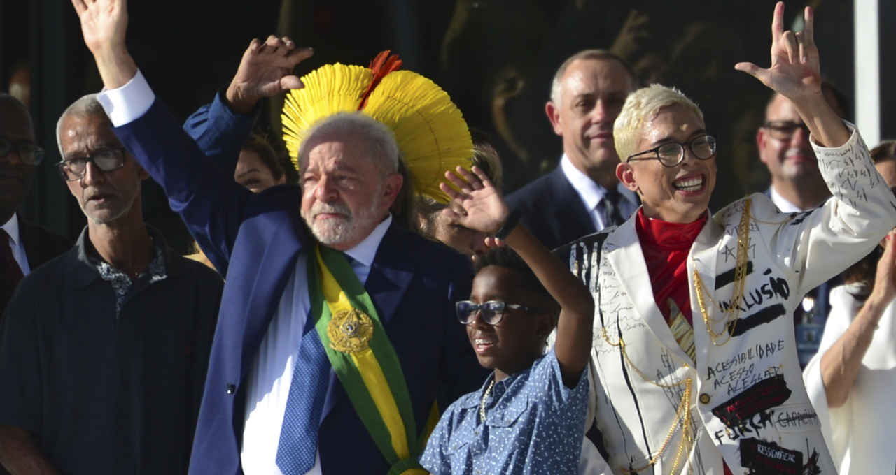

```{r xaringan-themer, include=FALSE, warning=FALSE}
options(htmltools.dir.version = FALSE)
list.of.packages <- c("remotes", "xaringan", "xaringanthemer")
new.packages <- list.of.packages[!(list.of.packages %in% installed.packages()[,"Package"])]
if(length(new.packages)) install.packages(new.packages)
remotes::install_github("mitchelloharawild/icons")
remotes::install_github("gadenbuie/xaringanExtra")

library(icons)
library(xaringanExtra)
library(xaringanthemer)
use_xaringan_extra(c("tile_view", "animate_css", "tachyons"))
use_extra_styles(hover_code_line = TRUE)
style_mono_accent(
  base_color          = "#1c5253",
  header_h1_font_size = "2rem",
  header_h2_font_size = "1.55rem",
  header_font_google  = google_font("Josefin Sans"),
  text_font_google    = google_font("Montserrat", "300", "300i"),
  text_font_size      = "1.1rem",
  code_font_google    = google_font("Fira Mono")
)
```

```{css, echo = F}
.bg_diretas {
  position: relative;
  z-index: 1;
}

.bg_diretas::before {    
      content: "";
      background-image: url(images/diretas01.jpg);
      background-size: cover;
      position: absolute;
      top: 0px;
      right: 0px;
      bottom: 0px;
      left: 0px;
      opacity: 0.2;
      z-index: -1;
}

.bg_congress01 {
  position: relative;
  z-index: 1;
}

.bg_congress01::before {    
      content: "";
      background-image: url(images/congress01.jpg);
      background-size: contain;
      position: absolute;
      top: 0px;
      right: 0px;
      bottom: 0px;
      left: 0px;
      opacity: 0.2;
      z-index: -1;
}

.large { font-size: 120% }
.small { font-size: 80% }
```

# Outline

* First half of the lecture:

  - A brief overview of the Brazilian political system: Fragmented parties, open-list proportional representation, and strong presidential rule ([Figueiredo and Limongi, 2000](https://www.jstor.org/stable/422395))
  
  - How Brazilian parties became more ideological over time ([Hagopian, Gervasoni and Moraes, 2008](https://doi.org/10.1177%2F0010414008325572))

  - Brazil's new populist right: The rise (and fall?) of Jair Bolsonaro ([Hunter and Power, 2019](https://doi.org/10.1353/jod.2019.0005))

--

* Second half of the lecture:

  - Our new research on legislature size and welfare provision in Brazil ([Mignozzetti, Cepaluni and Freire, 2022](https://github.com/umbertomig/legislature-size-welfare))

  - Questions

---

class: center, middle, bg_diretas

# An overview of the Brazilian political system

---

# Background: 1964 to 1985 - military dictatorship and democratisation 

.pull-left[
* From 1964 to 1985, Brazil was under military rule

* In 1988, Congress promulgated **a new democratic constitution**

* Presidential system with **open-list proportional representation and unrestricted number of parties**

* **More than 30 active parties** in Congress

* **All governments are by definition coalition governments**, ranging from five to ten parties (or more)

* **Massive transaction costs**
]

.pull-right[]

---

# Background: 1985 until today - democratic consolidation

.pull-left[
* **Improvements:**

  - Regular, free and fair elections
  - 4<sup>th</sup> largest democracy
  - 100% electronic voting
  - Significant social improvements
  - New social movements
  - Peaceful transitions of power

* **Ongoing problems:**

  - Political corruption widespread
  - Persistent economic inequality
  - Hyper-inflation until President Cardoso's [Plano Real](https://www.npr.org/blogs/money/2010/10/04/130329523/how-fake-money-saved-brazil) in 1994
  - Volatile electorate
  - Low-quality education
]

.pull-right[]

---

# What the literature said in the early 1990s

* Most political scientists believed that Brazil was .dark-green[too difficult to govern, thus the large-scale reforms the country needed would never be implemented]

* Even high-profile politicians shared this view. President Cardoso, who ruled from 1994 to 2002, lamented that Brazil's  .dark-green["ideologically fuzzy" political parties and autonomous politicians made the task of gathering a majority for a bill a "case-by-case exercise" requiring arduous negotiations] (.i[apud] [Hagopian, Gervasoni and Moraes, 2008, 361](https://doi.org/10.1177%2F0010414008325572))

* The problem of governance in Brazil could be summarised as follows:

--

*The combination of undisciplined parties, party system fragmentation, and federalism disperses power and makes it difficult for presidents to establish solid support in Congress. [...] This is why the presidents' lack of reliable majority support in Congress presented problems for effective governance. And it is why Sarney, Collor, and Franco had a hard time getting their agendas accomplished despite possessing sweeping constitutional powers.*


.pull-right[ — [Mainwaring and Shugart (1997)](https://www.cambridge.org/core/books/abs/presidentialism-and-democracy-in-latin-america/multipartism-robust-federalism-and-presidentialism-in-brazil/CE6A9F5C28F5717779611F73561A075D)
]

---

class: center, middle, bg_congress01

# But is Brazil indeed impossible to govern?

--

<br>
.small[*Hint: It's not!*]

---

# Figueiredo and Limongi

* Previous authors did not pay much attention to **the inner workings of political parties in Brazil**

* More importantly, scholars relied too much on **anecdotal evidence and legislation** to make inferences about the National Congress

* [Figueiredo and Limongi (2000)](https://www.jstor.org/stable/422395) went in the opposite direction: 

--

  - Manually counted each legislative vote and estimated how often Congress approved executive-sponsored bills 
  
--

  - Very high rates of approval: 78%
  
--

  - Highly disciplined government coalitions
  
--

  - **Presidents do form successful governments**
  
--

- Question: **_How do governments monitor and enforce party discipline?_**

---

# Presidential legislative power and centralised legislative work

* **Institutional variables** explain the success of presidential coalitions

--

.pull-left[
* **Presidential powers**:

  - Presidents can issue provisional decrees with immediate force of law
  - Congress has 30 days to vote
  - If not voted, they lose efficacy
  - **However, they can be reissued**
  - This indicates the government is interested in the decree
  - **Executive controls the budget and appointed positions**, so they can punish party that do not align with the government
]

--

.pull-right[
* **Centralised legislative work**:

  - Parties above 5% of seats announce their official position on issues
  - We can compare how many deputies actually followed party positions
  - Results: **Mean discipline above 85%** for biggest parties
  - **Leaders control campaign funding**, so deputies that do not follow guidelines have less money
]

---

# Bills presented

.center[]

---

# Party discipline

.center[]

---

# Coalitions are stable

.center[]

---

# Figueiredo and Limongi: Wrap-up

.large[
* Presidential coalitions are stable, parties are disciplined, and deputies have **no incentives to be in opposition**

* **Executive controls budget** and deputies want their amendments to be executed

* **Leaders control party finances**, and highly competitive campaigns require substantial funding

* Executive dominance found in Brazil is **similar to that of parliamentary regimes**

* Therefore, **presidential regimes can be as effective as parliamentary ones**
]

---

# Digging a bit deeper into party discipline

.large[
* Why have Brazilian parties become more disciplined?

* Electoral volatility decreased and party unity rose considerably in the 1990s-2000s

* While the left-wing Workers' Party (*Partido dos Trabalhadores - PT*) has always been disciplined, this is also true **for all big parties**
]

--

.large[
* Question: **_What explains the emergence of party-oriented legislators in Brazil?_**
]

---

# Market reforms and party discipline

.large[
* [Hagopian, Gervasoni and Moraes (2008)](https://doi.org/10.1177%2F0010414008325572) argue that the answer lies **_in market-oriented reforms_** proposed by President Cardoso (1994-2002)

* What is the mechanism that links economic liberalism and stronger parties?
]

--

.large[
* In the early 1990s, Cardoso launched a large liberalisation programme, selling many large state-owned enterprises and adopting fiscal discipline

* **Market reforms reduce the scope for patronage and clientelism**

* With fewer political appointments and money that could be captured by state officials, individual candidates have fewer resources to distribute to voters
]

---

# Market reforms and party discipline

.large[
* Privatisation and fiscal discipline often create winners and losers

* The public becomes **more polarised about the issue**

* Parties then have an incentive to become more programmatic, either in favour or against market reforms

* Power then becomes concentrated in party leaders and more ideologically-driven candidates

* Combined with less pork available, **this leads to a reduction in the number of candidates**

* The result?
]

--

.large[
* **More disciplined members tend to be elected and have more power within the party**
]

---

# Model explained

.center[

]

---

# Empirical results

.center[

]

---

# Empirical results

.center[

]

---

# Hagopian, Gervasoni and Moraes: Wrap-up

.large[
* GDP per capita is positively associated with partisan campaigns, delegation, and no party switching

* Local networks are negative correlated with those measures

* Importantly, **party polarisation and programme value** are strongly associated with partisan campaigns, delegation, no party switching, and voting discipline

* Thus, market reforms help presidents to form more programmatic coalitions and change power from local politicians to ideological party leaders
]

---

background-image: url(images/inflation.webp)
background-size: contain

---

background-image: url(images/bolsafamilia.jpg)
background-size: cover

---

background-image: url(images/logos.jpg)
background-size: cover

---

background-image: url(images/takesoff.webp)
background-size: contain

---

class: center, middle, inverse

# But then what happened?

---

background-image: url(images/economist.jpg)
background-size: contain

---

# The perfect storm part 1: Dilma Rousseff's failed economic policies

.pull-left[
* Lula left his government in 2010 with 80% approval

* Dilma Rousseff succeeded him, and she presided over the worst economic crisis Brazil had in 100 years

* GDP declined by 8% in two years (2014-2016), the entire GDP of Peru

* Unemployment rose to 13%, underemployment to 24%

* She lost support of their coalition (and even her own party), and was impeached in 2016

* Demand for **anti-left candidates**

]

.pull-right[]

---

background-image: url(images/doom.png)
background-size: contain

---

# The perfect storm part 2: *Lava Jato* 

.pull-left[
* **The _Operation Car Wash (Lava Jato)_** was a massive investigation against political corruption in Brazil

* Started investigating money laundering in auto-service stations

* Ended up with a much larger bribery at Petrobras, which embroiled even former President Lula

* **Lula was eventually arrested in 2017**

* **Strong sentiment against the Workers' Party and democracy**

* Demand for **anti-establishment candidates**
]

.pull-right[]

---

# The perfect storm part 3: Rising crime

.pull-left[
* Given the serious economic crisis, criminality started to rise

* Both rich and poor citizens sought credible promises of protection

* More than 60k people were murdered in 2017, murder rate was 30.8 per 100,000 people - even worse than Mexico's

* **Strong support for _mano dura_ policies**

* Demand for **law and order candidates**
]

.pull-right[]

---

class: center, middle, inverse

# An anti-left, anti-establishment, hard-line candidate?

---

background-image: url(images/bolsonaro.jpg)
background-size: cover

---

# Some reasons for optimism

.large[
* Despite Bolsonaro's election, Brazilian institutions have worked well

* Courts have limited his abuses, political opposition has been very strong

* A largely independent candidate, Bolsonaro has not been able to form a solid coalition, what shows that parties remain crucial for governance

* Population also punished him for his handling of the pandemic: 20% of approval

* Eventually, Lula was elected for a third term by a very tight margin (~1.5%)

* However, _bolsonarismo_ has outlasted Bolsonaro
]

---

# Lula's third term

.pull-left[
* **Improvements:**

  - New plan of investment and infrastructure
  - Social reforms: more diversity in politics
  - New social movements: LGBT+, black movements
  - Good approval ratings for the president

* **Ongoing problems:**

  - Fierce political opposition: Bolsonarismo
  - Extreme polarization
  - Economic populism
  - Controversial foreign policy
  - Shadow of corruption scandals
]

.pull-right[]
---

class: center, middle, inverse

# Time for a quick break?

---

class: left, middle, inverse

# Legislature Size and Welfare: Evidence from Brazil

<br>

#### Umberto Mignozzetti (University of Califonia, San Diego)
#### Gabriel Cepaluni (Lincoln)
#### Danilo Freire (Lincoln)

---

# Motivation

* Institutional design significantly impacts redistributive politics

--

* Yet little is known about the effect of legislative features on policy outcomes

--

* Here we tackle one question that all democracies face in their institution building process: 

--

* **Does increasing legislature size result in better public service delivery?**

---

# Motivation

* The number of legislators affects policymaking, taxation, government spending, and representation

--

* However, larger legislatures not only increase bargaining costs to the government...

--

* ..but they can also be expensive to taxpayers

---

# Motivation

.pull-left[
```{r, cache=TRUE, fig.cap="Councils that cost more than US$ 80.00 per capita (red dots)", echo=FALSE, out.width="80%"}
knitr::include_graphics("images/alltowns.png")
```
]

.pull-right[
```{r, cache=TRUE, fig.cap="City with highest cost per capita: US$ 400", echo=FALSE}
knitr::include_graphics("images/mostexpensive.png")
```
]

---

# What we do

* We propose a formal model to explain how legislature size affects bargaining costs in city councils

* We exploit exogenous variation in Brazilian city council sizes and test whether larger legislatures improve public service provision

* We analyse the contents of 346,553 bills to see whether there is an increase in legislation related to public service delivery

* We survey 174 former councillors to investigate potencial political mechanisms and provide qualitative evidence for our results 

---

# What we find

* Larger city councils change the composition of mayoral coalitions and the number of appointed bureaucrats in the municipality

* The extra city councillor has a 91 percent chance of belonging to the mayor's pre-electoral coalition, what *decreases* the bargaining costs for the mayor and boosts investments in public services

* Municipalities with larger city councils have around 15 percent more public goods provision proposals

---

# What we find

* Increasing city council size by one legislator lowers infant mortality by 2 children per one thousand infants born and reduces post-neonatal mortality by 0.90 children per one thousand infants that survived their first 28 days

* A larger council size also increases enrolment by 2.58 children in elementary education classrooms without diminishing school quality

* **In sum, increasing legislature size does result in better public service provision** (at least in Brazil!)

---

# Number of legislators and social welfare

* Alchian and Demzets (1972): team productivity
  - More legislators: increase productivity frontier but risk of moral hazard

* Weingast et al. (1981): Law of 1/*n*
  - Diffuse costs and concentrated benefits: Free-riding on common pool taxes. Overprovision (?)

* Crain et al. (1979, 1982, 2012): Representation of interest groups
  - Easier to lobby but coordination problems within legislature
  - More representation, better service provision

* Empirical findings: mixed evidence (Freire et al., 2021)

---

# Governing costs without partisanship

* (_After some algebra, which I'll happily skip here!_)

* In the baseline non-partisan reversal policy, bargaining costs always increase when the size of the legislature increases

.center[
```{r, cache=TRUE, fig.cap="Bargaining costs increase in larger legislatures", echo=FALSE, out.width="50%"}
knitr::include_graphics("images/govcostsnopart.png")
```
]

---

# Governing costs with partisanship

* If the chances of electing a councillor aligned with the mayor are high, increasing legislature size decreases the costs of governing

* Thus, more public goods provision (and rents)

.center[
```{r, cache=TRUE, fig.cap="Bargaining costs decrease with partisanship", echo=FALSE, out.width="80%"}
knitr::include_graphics("images/govcostspartconcern.png")
```
]

---

# Empirical strategy

* Brazil is the ideal test ground for this theory
  - The country has wide variation in terms of welfare
  - The budget is mostly fixed (transfers)
  - And city council size changed in 2005 and 2008 in a way that allows us to study the effect council size on welfare

* Councils before law change:

.center[
```{r, cache=TRUE, fig.cap="", echo=FALSE, out.width="90%"}
knitr::include_graphics("images/table01.png")
```
] 

---

# Arbitrary council sizes

* Municipalities used to define council sizes inefficiently:

.pull-left[
```{r, cache=TRUE, fig.cap="Nova Russa (25,000 inhabitants and 21 councilors)", echo=FALSE, out.width="90%"}
knitr::include_graphics("images/novasrussas-1.png")
```
]

.pull-right[
```{r, cache=TRUE, fig.cap="Sorocaba (550,000 inhabitants and 14 councilors)", echo=FALSE, out.width="90%"}
knitr::include_graphics("images/sorocaba-1.png")
```
]

---

# Mira Estrela

.center[
```{r, cache=TRUE, fig.cap="Mira Estrela: 2,000 inhabitants and 11 councilors", echo=FALSE, out.width="80%"}
knitr::include_graphics("images/miraestrela2-1.png")
```
]

---

# Supreme Court ruling

.center[
```{r, cache=TRUE, fig.cap="", echo=FALSE, out.width="80%"}
knitr::include_graphics("images/distrSeats-1.png")
```
]

---

# Estimation

* Sharp RD: municipalities close to thresholds are comparable
* Only difference: legislature size
* A perfect RDD estimation relies on three assumptions: 
  - No manipulation
  - For multiple thresholds: multiplicity correction
  - No pre-treatment variation.

* We developed an estimation technique for the multiple cutoffs problem.

---

# Legislature size, representation, and composition of local chambers

* **_H1_**: Bargaining costs decrease with legislature size when the chance of electing a government-aligned legislator is high
* **_H2_**: Public goods provision increases when bargaining costs decrease

* Alternative hypothesis:
  - **_AH1_**: Female representation increases with legislature size
  - **_AH2_**: Non-whites representation increase with legislature size
  - **_AH3_**: Election competitiveness increases with legislature size
  - **_AH4_**: The legislative production increases with legislature size

---

# Legislature size, representation, and composition of local chambers

.center[
```{r, cache=TRUE, fig.cap="", echo=FALSE, out.width="65%"}
knitr::include_graphics("images/fig1.png")
```
]

---

# Effect of legislature size on welfare

.center[
```{r, cache=TRUE, fig.cap="", echo=FALSE, out.width="65%"}
knitr::include_graphics("images/fig5.png")
```
]

---

# Evidence from proposed legislation

.center[
```{r, cache=TRUE, fig.cap="", echo=FALSE, out.width="80%"}
knitr::include_graphics("images/fig4.png")
```
]

---

# Evidence from former legislators

.center[
```{r, cache=TRUE, fig.cap="", echo=FALSE, out.width="80%"}
knitr::include_graphics("images/fig2.png")
```
]

---

# Discussion

* Partisanship considerably decreases bargaining costs, improving welfare

* Increasing the council size results in gains in elementary school enrolment and in lower infant mortality without decreasing school quality

* Our findings are consistent with the hypothesis that former Presidents Cardoso and Lula increased social indicators due to large government coalitions

---

# Discussion

* Implications that extend beyond Brazil. Several countries have local city councils and multiparty systems, so the dynamics we expose here may explain how fragmented legislatives are not synonymous with policy paralysis

* In contrast with well-established theories that point out that multipartism is a peril to democratic regimes

* Our findings may help us understand why countries in Latin America and Asia can generate effective governance despite having strong executives and large coalitions

---

# Further research

* If the mechanism we suggest is indeed at work, more support for the Executive means better public goods
  - How extensive should the city council's checking prerogatives be, as they significantly reduce the provision of public services?

* It remains uncertain how other legislative features affect welfare
  - What is the effect of monetary compensation for councillors and committee structure on public welfare?

--

* **Any suggestions on how to tackle these questions are greatly appreciated! :)**

---

class: center, middle, inverse

# Questions?

---

# Seminar discussion

* Discuss the strengths and weaknesses of Brazil's open-list proportional representation system and the presence of a large number of political parties in Congress.

* Discuss the role of coalitions in both Brazilian and British politics. How do coalition governments function in the two countries, and how do they impact the effectiveness of governance?

* How do the experiences of minority and marginalized groups in politics differ between Brazil and the UK? Discuss the representation of these groups in both countries' political parties and legislatures.

* What lessons can Brazil and the UK learn from each other's political systems in terms of promoting democratic stability, effective governance, and inclusive representation?


---

class: center, middle, inverse

# Thank you very much!

---

# Contact information

<br>

* Danilo Freire:

  - [dfreire@lincoln.ac.uk](mailto:dfreire@lincoln.ac.uk)
  - <http://danilofreire.github.io>
  - <http://github.com/danilofreire/cl2022>

